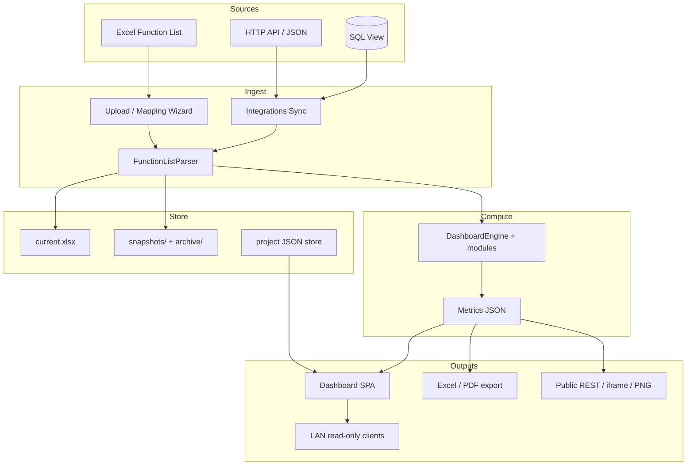

# Kiến trúc hệ thống — iHRP Function List Tracker

> **Single source of truth** cho kiến trúc end-to-end (cập nhật 2026-07-30).
> Chi tiết chuyên sâu → các guide ở mục [11. Tài liệu liên quan](#11-tài-liệu-liên-quan).

## Mục lục

1. [Mục đích sản phẩm](#1-mục-đích-sản-phẩm)
2. [Tech stack](#2-tech-stack)
3. [Cấu trúc thư mục](#3-cấu-trúc-thư-mục)
4. [Data flow end-to-end](#4-data-flow-end-to-end)
5. [Project storage layout](#5-project-storage-layout)
6. [Auth & security](#6-auth--security)
7. [Module map (analyzer / parser / exporter)](#7-module-map)
8. [API surface](#8-api-surface)
9. [Frontend architecture](#9-frontend-architecture)
10. [Testing](#10-testing)
11. [Tài liệu liên quan](#11-tài-liệu-liên-quan)
12. [Roadmap còn lại (P2)](#12-roadmap-còn-lại-p2)

---

## 1. Mục đích sản phẩm

Ứng dụng **dashboard local** cho PM/BA dự án triển khai HRIS **iHRP** (Minh Phú / FIS).

- Nhận file Excel **Function List** (hoặc đồng bộ từ API/DB nguồn).
- Auto-detect cột (không hardcode) → parse Phase / Status / Module / PIC.
- Sinh dashboard tracking đa chiều, drill-down, so sánh snapshot, xuất Excel/PDF.
- Hỗ trợ **multi-project**, chia sẻ **LAN read-only**, **Public API** (REST / iframe / PNG) cho partner.

Nguyên tắc gốc (`.cursorrules`): không hardcode cột; overdue = End < today và Status ∉ {Closed, Cancelled}; status chuẩn hóa; PIC tách bởi `, ; + \n`.

---

## 2. Tech stack

| Lớp | Công nghệ |
|-----|-----------|
| Backend | Python 3.10+ / **Flask 3** |
| Frontend | Vanilla ES6, **Tailwind CDN**, **Chart.js CDN** (không build step) |
| Excel | **openpyxl** (không dùng pandas) |
| HTTP integrations | **requests** + **beautifulsoup4** (CSRF form login) |
| PDF (client) | html2canvas + jsPDF (trong browser) |
| PNG public (optional) | Playwright + Chromium |
| DB integration (optional) | pyodbc / psycopg2 / pymysql — lazy import |
| Persistence | File JSON + pickle + xlsx trên disk — **không database app** |
| Test | pytest (+ pytest-cov, requests-mock) |

Launcher: `start.bat` / `start.sh` (Windows tự kill port 5000 nếu conflict).

---

## 3. Cấu trúc thư mục

```
Project_Tracking/
├── start.bat / start.sh          # Launcher
├── requirements.txt              # Runtime deps
├── requirements-dev.txt          # Dev extras (nếu có)
├── .env / .env.example           # Credential integrations (KHÔNG commit .env)
├── app.py                        # Flask app — routes admin + public + embed
├── parser/
│   ├── excel_parser.py           # Auto-detect header + parse Function List
│   └── column_mapping.py         # Fuzzy suggest + mapping wizard helpers
├── analyzer/                     # Metrics, integrations, storage helpers
│   ├── dashboard_engine.py       # compute_all() — metrics chính
│   ├── risk_scorer.py            # Risk 0–100
│   ├── snapshot_manager.py       # Snapshot hot + load (kể cả archived)
│   ├── archive_manager.py        # Gzip archive / restore / purge
│   ├── compare_engine.py         # So sánh 2 snapshot / cross-project
│   ├── project_manager.py        # Multi-project CRUD + migrate legacy
│   ├── project_store.py          # JSON store: settings, bookmarks, tokens…
│   ├── integrations.py           # Registry API + sync (HTTP/DB)
│   ├── public_api.py             # Token verify, scopes, rate limit, PNG
│   ├── lan_security.py           # Localhost-only admin + access log
│   ├── gantt_calendar.py         # Gantt Calendar Excel-style
│   ├── data_quality.py           # DQ rules + export
│   ├── drill_down.py             # Chart → function list
│   ├── generic_chart.py          # Custom dashboard aggregate + drill
│   ├── digest.py                 # Weekly digest cron-lite
│   ├── kanban.py / palette.py / portfolio.py / …
│   └── type_infer.py             # Suy đoán kiểu cột (smart mapping)
├── exporter/
│   ├── excel_exporter.py         # Overdue / full / by-pic / compare
│   ├── weekly_mom.py             # Báo cáo tuần MoM (mẫu W30) + PM Dashboard
│   └── export_all_issues.py      # Workbook multi-sheet “toàn bộ vấn đề”
├── templates/
│   ├── index.html                # SPA dashboard
│   └── embed.html                # Public iframe chart
├── static/
│   ├── css/style.css
│   └── js/
│       ├── dashboard.js          # UI chính (~13k+ LOC)
│       ├── help_content.js       # HELP_CONTENT topics
│       └── palette.py → palette.js
├── tests/                        # ~30 file test_*.py — ~790 passed
├── uploads/
│   ├── projects/                 # Per-project workspace
│   └── tmp/                      # Upload-preview tạm (TTL 24h)
├── .project_store/               # Digests / access.log (một số path legacy)
└── docs/                         # Tài liệu (file này + guides)
```

---

## 4. Data flow end-to-end

### 4.1 High-level



### 4.2 Upload thủ công

```
User chọn .xlsx
  → (default) POST /api/upload-preview → tmp + fuzzy suggest + modal mapping
  → POST /api/upload-confirm {tmp_id, column_mapping, project_slug}
     hoặc POST /api/projects/<slug>/upload (skip wizard)
  → FunctionListParser.parse(path, column_mapping?)
  → DashboardEngine.compute_all(parsed)
  → SnapshotManager.save_snapshot(..., source="upload")
  → _state[slug] cache + trim payload → JSON dashboard
```

### 4.3 Sync từ Registry API / DB

```
User bấm 🔄 Đồng bộ (dropdown hoặc modal)
  → FE mở Sync Progress modal (các bước UI)
  → POST .../integrations/<id>/sync {endpoint_id}
  → integrations: auth (.env) → fetch excel|json|SQL
  → (json) field_mapping → build xlsx
  → parse + metrics + snapshot (source="sync:<integ>:<ep>")
  → optional replace current.xlsx
  → FE refresh dashboard + cập nhật upload-history (cột Nguồn)
```

### 4.4 Đọc dashboard / public

```
GET /api/projects/<slug>/dashboard?module=&process=&pic=
  → load state (memory hoặc disk pickle)
  → optional _filter_parsed_data
  → compute_all + trim → UI

GET /public/api/v1/... + X-API-Key
  → verify token hash + scope + rate limit
  → trả subset metrics / functions / PNG
```

---

## 5. Project storage layout

Mỗi project = 1 folder dưới `uploads/projects/<slug>/`:

```
uploads/projects/
├── projects.json                 # Index toàn bộ project
└── <slug>/
    ├── meta.json
    ├── current.xlsx              # File hiện hành
    ├── integrations.json         # Registry API (KHÔNG chứa secret)
    ├── archive_settings.json     # Auto-archive thresholds
    ├── project_settings.json     # Digest, SLA, thresholds…
    ├── bookmarks.json
    ├── function_notes.json
    ├── chart_notes.json          # PDF comments
    ├── chart_configs.json        # Visibility / per-chart config
    ├── custom_dashboards.json
    ├── excel_mapping_presets.json
    ├── capacity.json / pic_roles / …
    ├── exports/                  # Excel xuất ra
    ├── digests/                  # Weekly digest YYYYMMDD.xlsx
    ├── synced_*.xlsx             # File tạm từ sync (nếu còn)
    └── snapshots/
        ├── snapshot_index.json   # + field source, archived
        ├── YYYY-MM-DD_functionlist.xlsx
        ├── YYYY-MM-DD_functionlist.parsed.pkl
        └── archive/              # *.xlsx.gz + *.pkl.gz (T-AA)
```

**Public tokens** (và một số cache PNG): `.project_store/<slug>/public_tokens.json`,
`public_cache/`. Mapping presets JSON API: theo integration trong project store.

**Snapshot entry** (rút gọn):

```json
{
  "date": "2026-07-30",
  "filename": "2026-07-30_functionlist.xlsx",
  "pickle": "2026-07-30_functionlist.parsed.pkl",
  "total_functions": 375,
  "overall_pct": 50.4,
  "overdue_count": 44,
  "source": "upload",
  "archived": false,
  "upload_time": "2026-07-30T08:40:37"
}
```

- `source`: `"upload"` | `"sync:<integ_id>:<endpoint_id>"`
- `archived`: `true` → file nằm trong `snapshots/archive/*.gz`; load vẫn transparent

Chi tiết schema JSON → [`DATA_MODEL.md`](DATA_MODEL.md).

---

## 6. Auth & security

| Cơ chế | Mô tả |
|--------|--------|
| **`.env` credentials** | Username/password/token/API key theo prefix integration. Không lưu trong `integrations.json`. |
| **Admin localhost-only** | `lan_security.install_admin_guard`: POST/PUT/DELETE `/api/*` (trừ export) chỉ từ `127.0.0.1` / `::1` (hoặc `IHRP_LAN_ADMIN_ALLOW`). |
| **LAN bind** | Mặc định `127.0.0.1:5000` (solo-safe). Mở LAN: `IHRP_LAN=1` hoặc `IHRP_BIND_LOCAL_ONLY=0` → `0.0.0.0`. Helper: `lan_security.resolve_bind_host`. |
| **Public API tokens** | `pub_<40 hex>`, lưu SHA-256; scope ACL; rate limit 60 req/60s/token; CORS GET. |
| **verify_ssl** | Per-integration `auth.verify_ssl` (default `true`). Tắt chỉ khi cert nội bộ thiếu CA. |
| **Access log** | `.project_store/access.log` — LAN + admin deny events. |
| **Upload tmp** | `tmp_id` hex-only (chống path traversal); TTL 24h. |

Guides: [`LAN_DEPLOY_GUIDE.md`](LAN_DEPLOY_GUIDE.md), [`PUBLIC_API_GUIDE.md`](PUBLIC_API_GUIDE.md), [`INTEGRATIONS_GUIDE.md`](INTEGRATIONS_GUIDE.md).

---

## 7. Module map

### Core parse & metrics

| Module | Trách nhiệm |
|--------|-------------|
| `parser/excel_parser.py` | Header detect, phase groups `"Name - Attr"`, normalize date/status/PIC |
| `parser/column_mapping.py` | Fuzzy + bilingual alias cho Mapping Wizard |
| `analyzer/type_infer.py` | Suy đoán kiểu cột (date/PIC/status/number) — smart mapping |
| `analyzer/dashboard_engine.py` | `compute_all` — summary, matrix, PIC, overdue, effort, timeline… |
| `analyzer/risk_scorer.py` | Risk score 0–100 (8 yếu tố) |
| `analyzer/advanced_metrics.py` | Burndown, SLA, capacity load, slow heatmap, baseline… |
| `analyzer/drill_down.py` | Chart cell → list function |
| `analyzer/generic_chart.py` | Custom dashboard aggregate + drill |
| `analyzer/data_quality.py` | DQ issues + filter Module |
| `analyzer/gantt_calendar.py` | Timeline Excel-style (day/week/month) |
| `analyzer/compare_engine.py` | Delta 2 snapshot |
| `analyzer/fitgap_analytics.py` | FIT/GAP chuyên sâu |
| `analyzer/function_diff.py` / `function_traceability.py` | Diff / trace |
| `analyzer/kanban.py` | Board theo status/PIC |
| `analyzer/digest.py` | Weekly digest generate + startup schedule |
| `analyzer/portfolio.py` | Cross-project search / rollup / compare |

### Storage & ops

| Module | Trách nhiệm |
|--------|-------------|
| `project_manager.py` | CRUD project, slugify, migrate V2→V3 |
| `snapshot_manager.py` | Save/load/list; `source`; load archived gzip in-memory |
| `archive_manager.py` | Archive / restore / auto-archive / purge + checksum |
| `project_store.py` | Mọi JSON per-project + archive_settings + mapping presets |
| `disk_janitor.py` | Dọn file tạm / dung lượng |
| `lan_security.py` | Admin guard + access log + detect LAN IPs |

### Integrations & public

| Module | Trách nhiệm |
|--------|-------------|
| `integrations.py` | 4 HTTP auth + `database`; excel/json sync; `verify_ssl` |
| `public_api.py` | Token CRUD helpers, scopes, rate limit, PNG render |
| `exporter/excel_exporter.py` | Overdue / full / by-pic / compare |
| `exporter/weekly_mom.py` | Báo cáo tuần MoM (Cover + Master plan khung + MoM_Wxx + PM Dashboard) |
| `exporter/export_all_issues.py` | 8-sheet “toàn bộ vấn đề” |

### Frontend JS

| File | Trách nhiệm |
|------|-------------|
| `static/js/dashboard.js` | Toàn bộ section, sync modal, settings, mapping wizard… |
| `static/js/help_content.js` | Nội dung help + categories |
| `static/js/palette.js` | Semantic colors (progress tiers…) |

---

## 8. API surface

Ba lớp route (chi tiết đầy đủ nằm trong `app.py`):

### A. Admin (localhost mutations)

**Projects:** `GET/POST /api/projects`, `GET/PUT/DELETE /api/projects/<slug>`, restore.

**Ingest:** upload, upload-preview/confirm, mapping-presets, validate-mapping,
integrations CRUD + test + sync + preview-json + mapping-presets per integration.

**Analytics (GET, LAN-readable):** dashboard, overdue, unassigned, long-duration,
stalled, risk-scores, drill-down, gantt-calendar, data-quality, aging-wip,
kanban, burndown, sla, capacity-load, fitgap, function-diff, custom-dashboard…

**Snapshots / compare / archive:** snapshots list/delete, compare, upload-compare,
archive-settings, archive-run, snapshot archive/restore.

**Exports:** overdue, full, by-pic, compare, all-issues, gantt-calendar,
data-quality, aging-wip, chart, audit-report, package zip…

**Settings / UX state:** settings, chart-notes, chart-config, bookmarks, notes,
digests, capacity, saved-views, section-order, module-order, pic-roles, phase-aliases.

**Module order** (`GET|PUT /api/projects/<slug>/module-order`,
`POST .../module-order/reset`): persist `module_order.json` → reorder
`ParsedData.all_modules` cho mọi list/sort theo module (filter dropdown,
overview, matrix, process tiles, gantt, export). Default alphabetical.
Chi tiết schema: [`DATA_MODEL.md`](DATA_MODEL.md#module_orderjson--thứ-tự-module-toàn-dashboard).

Default section order (khi chưa có `section_order.json`): summary → **rlog** →
cảnh báo (overdue → unassigned → stalled → risk → aging-wip → sla → dataquality),
rồi tiến độ / timeline, quản trị cuối (compare → digest → history). Chi tiết:
[`DASHBOARD_SPEC.md`](DASHBOARD_SPEC.md#default-section-order-ux--cảnh-báo-trước).

**Public token admin:** `GET/POST/DELETE .../public-tokens`, `GET .../public-scopes`.

**LAN info:** `GET /api/lan/info`, `GET /api/lan/access-log` (admin).

### B. Public (token)

```
GET /public/api/v1/projects/<slug>/summary
GET /public/api/v1/projects/<slug>/charts/<chart_id>
GET /public/api/v1/projects/<slug>/charts/<chart_id>/image   # optional Playwright
GET /public/api/v1/projects/<slug>/functions?page=&size=
```

Auth: header `X-API-Key` hoặc `?token=`.

### C. Embed

```
GET /embed/<slug>/<chart_id>?token=&bg=
```

→ `templates/embed.html` (Chart.js tối giản).

Legacy routes không có `/projects/<slug>/` vẫn trỏ project `"default"`.

---

## 9. Frontend architecture

Single page `templates/index.html` + `dashboard.js`.

### Shell UI

- Header: project selector, search, dark mode, 🔌 API Registry, 🔄 Sync ▾,
  📄 PDF, 📊 Xuất vấn đề, 🎬 Trình chiếu, ⚙️ Cài đặt, ❓ Help, Ctrl+K palette.
- Sidebar nav jump section.
- Global filter: Module × Quy trình × PIC → recompute backend.
- Sync Progress modal: các bước Auth → Fetch → Parse → Snapshot → Refresh.
- `apiJson()` helper: lỗi HTML từ server → message thân thiện (không crash JSON.parse).

### Section groups (ẩn/hiện qua Settings)

1. **Tổng quan** — summary cards, module overview, phase matrix…
2. **Tiến độ & Timeline** — stacked phase, giai đoạn, Gantt Calendar, burndown, SLA…
3. **Phân tích** — PIC, priority/complexity, FIT/GAP, effort, duration, process treemap…
4. **Danh sách & cảnh báo** — overdue, unassigned, stalled, risk, aging WIP, DQ, bookmarks, digests, upload history (cột **Nguồn**)
5. **Tùy chỉnh** — custom dashboards, kanban, compare, portfolio…

### Help system

- Nút `?` per-section → modal từ `HELP_CONTENT`.
- Global Help (Ctrl+/) + onboarding tour 8 bước.
- Xem [`HELP_CONTENT_GUIDE.md`](HELP_CONTENT_GUIDE.md).

### Spec chi tiết từng section

→ [`DASHBOARD_SPEC.md`](DASHBOARD_SPEC.md).

---

## 10. Testing

```bash
pytest -q
# hoặc có coverage:
pytest tests/ --cov=parser --cov=analyzer --cov=exporter --cov-report=term-missing
```

- ~**790** tests passed (2026-07-30).
- Coverage các module core parser / engine / integrations / public_api / archive / LAN.

---

## 11. Tài liệu liên quan

| File | Nội dung |
|------|----------|
| [`README.md`](README.md) | Mục lục docs + cách chạy + feature overview |
| [`DATA_MODEL.md`](DATA_MODEL.md) | Schema Excel parse + JSON store |
| [`DASHBOARD_SPEC.md`](DASHBOARD_SPEC.md) | Spec UI từng section |
| [`INTEGRATIONS_GUIDE.md`](INTEGRATIONS_GUIDE.md) | Registry API, auth, mapping, verify_ssl |
| [`PUBLIC_API_GUIDE.md`](PUBLIC_API_GUIDE.md) | REST / iframe / PNG + token |
| [`LAN_DEPLOY_GUIDE.md`](LAN_DEPLOY_GUIDE.md) | Chia sẻ LAN + firewall + admin guard |
| [`ARCHIVE_GUIDE.md`](ARCHIVE_GUIDE.md) | Auto-archive / restore / purge |
| [`HELP_CONTENT_GUIDE.md`](HELP_CONTENT_GUIDE.md) | Thêm topic help |
| [`IHRP_TASKDAILY_API_SETUP.md`](IHRP_TASKDAILY_API_SETUP.md) | Ví dụ sync Task Daily |
| [`BUGS_TODO.md`](BUGS_TODO.md) | Done / backlog / P2 |
| [`UPGRADE_V2.md`](UPGRADE_V2.md) / [`UPGRADE_MULTIPROJECT.md`](UPGRADE_MULTIPROJECT.md) | Historical |

---

## 12. Roadmap còn lại (P2)

Đã ship gần đây (không liệt kê hết): Public API 2A–2C, LAN secure, Smart mapping,
Gantt Calendar, Help unified, Archive auto, Sync progress UI, Export all issues,
verify_ssl, cột Nguồn lịch sử, DQ filter Module…

**Còn pending** (xem `_WIP_RESUME_NOTES.md` / `BUGS_TODO.md`):

| ID | Mô tả |
|----|--------|
| **T-B** | API Registry Catalog — metadata đầy đủ, filter, health, Postman import |
| **T-C** | Hoàn thiện `form_login` wizard (cookie jar, CSRF UX, 2FA optional) |

Nice-to-have nhỏ: auto-cleanup digests, presentation HUD buttons, thêm DQ rules…

---

## Phụ lục — Risk score (nhắc nhanh)

| Yếu tố | Điểm |
|--------|------|
| Priority Must / Should | +20 / +10 |
| Complexity High / Medium | +15 / +5 |
| Có phase overdue | +20 |
| Mỗi 7 ngày overdue | +10 (cap +30) |
| Phase active không PIC | +15 |
| Duration > threshold | +10 |
| Đình trệ | +10 |
| Risk/Blocker note | +5 |

Cap 100. Chi tiết implement: `analyzer/risk_scorer.py`.
