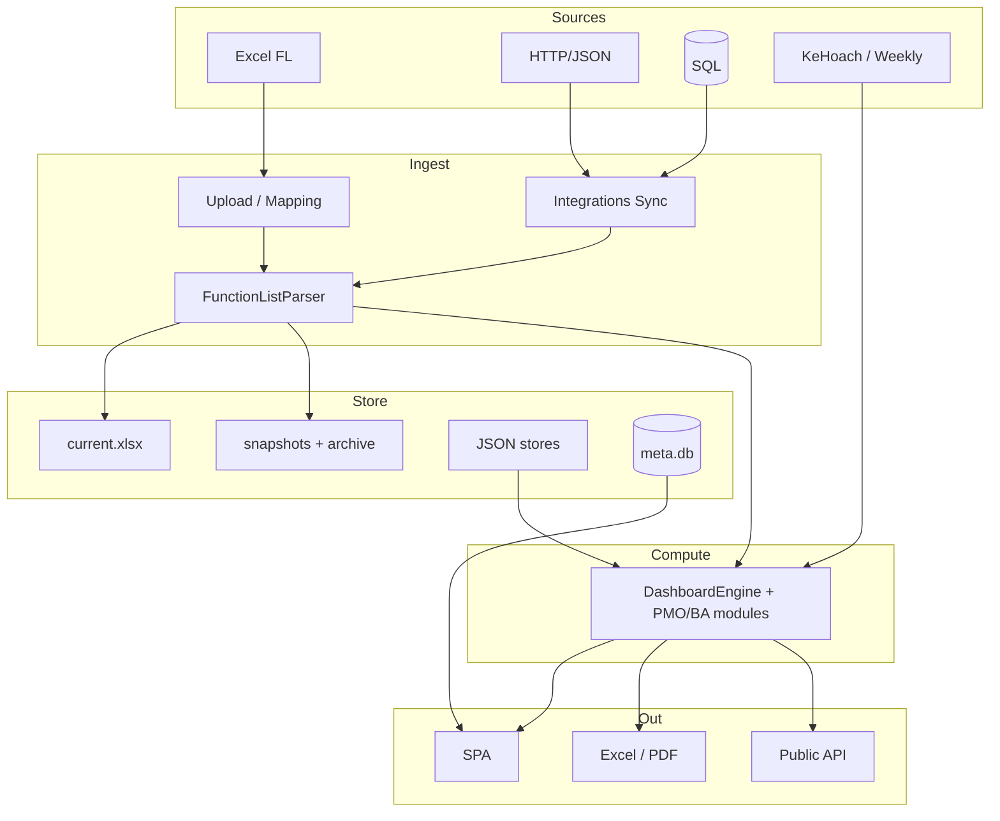

# Kiến trúc hệ thống — iHRP Function List Tracker

> **Single source of truth** kỹ thuật (cập nhật **2026-08-01**).  
> Tổng quan sản phẩm → [SYSTEM_OVERVIEW.md](SYSTEM_OVERVIEW.md). Catalog feature → [FEATURE_CATALOG.md](FEATURE_CATALOG.md).

## Mục lục

1. [Mục đích sản phẩm](#1-mục-đích-sản-phẩm)
2. [Tech stack](#2-tech-stack)
3. [Cấu trúc thư mục](#3-cấu-trúc-thư-mục)
4. [Data flow end-to-end](#4-data-flow-end-to-end)
5. [Project storage layout](#5-project-storage-layout)
6. [Auth & security](#6-auth--security)
7. [Module map](#7-module-map)
8. [API surface](#8-api-surface)
9. [Frontend architecture](#9-frontend-architecture)
10. [Testing](#10-testing)
11. [Tài liệu liên quan](#11-tài-liệu-liên-quan)
12. [Roadmap còn lại (P2)](#12-roadmap-còn-lại-p2)

---

## 1. Mục đích sản phẩm

Ứng dụng **dashboard local** cho PM/BA dự án triển khai HRIS **iHRP**.

- Nhận Function List Excel (hoặc sync API/DB) → auto-detect cột → metrics đa chiều.
- Multi-project, snapshot/archive, Forecast, PMO (SV/EVM/CR/Risk/UAT), BA UX, Chiều PM.
- Export Excel/PDF/MoM; Public API / LAN read-only.

Nguyên tắc `.cursorrules`: không hardcode cột; overdue = End < today ∧ Status ∉ {Closed, Cancelled}; status chuẩn hóa; PIC tách `, ; + \n`.

---

## 2. Tech stack

| Lớp | Công nghệ |
|-----|-----------|
| Backend | Python 3.10+ / **Flask 3** |
| Frontend | Vanilla ES6, Tailwind CDN, Chart.js CDN (không build step) |
| Excel | **openpyxl** (không pandas) |
| HTTP integrations | **requests** + **beautifulsoup4** (CSRF form login) |
| PDF (client) | html2canvas + jsPDF |
| PNG public (optional) | Playwright + Chromium |
| DB integration (optional) | pyodbc / psycopg2 / pymysql — lazy |
| Persistence | File JSON + pickle + xlsx; **Phase F:** `meta.db` (SQLite WAL) dual-write cho settings/bookmarks/tags |
| Test | pytest (+ pytest-cov, requests-mock) |

Launcher: `start.bat` / `start.sh`.

---

## 3. Cấu trúc thư mục

```
Project_Tracking/
├── start.bat / start.sh
├── requirements.txt
├── .env / .env.example          # KHÔNG commit .env
├── app.py                       # ~100 routes admin + public + embed
├── parser/
│   ├── excel_parser.py          # Auto-detect + parse FL
│   ├── column_mapping.py
│   ├── pm_plan_parser.py
│   └── pm_weekly_parser.py
├── analyzer/                    # Metrics, storage, integrations
│   ├── dashboard_engine.py      # compute_all
│   ├── overdue|unassigned|stalled|data_quality|rlog_weekly.py
│   ├── forecast_gantt|forecast_manpower|estimate_ratio|pic_overload|pic_upcoming.py
│   ├── baseline_sv|completion_forecast|earned_value|scope_creep.py
│   ├── risk_scorer|module_dependency|uat_quality.py
│   ├── gantt_calendar|function_diff|fl_reimport_verify.py
│   ├── snapshot_manager|archive_manager|disk_janitor.py
│   ├── project_manager|project_store|sqlite_store.py
│   ├── integrations|public_api|lan_security|pm_store.py
│   └── … (portfolio, kanban, digest, drill_down, …)
├── exporter/                    # Excel MoM, FL, forecast, overload, chart…
├── templates/                   # index.html SPA + embed.html
├── static/css|js/               # dashboard.js, help_content.js, i18n.js
├── tests/
├── uploads/projects/            # Per-project workspace (+ meta.db)
├── .project_store/              # users.json (hash MK), secret_key, tokens, access.log
└── docs/
```

---

## 4. Data flow end-to-end

### 4.1 High-level



### 4.2 Upload / Sync

```
Upload-preview → mapping confirm → parse → compute_all
  → SnapshotManager.save (source=upload|sync:…)
  → _state[slug] cache

Sync: auth → fetch → parse → snapshot → eager-reload _state
  → FE cacheBust + refresh
```

### 4.3 Đọc dashboard

```
GET /api/projects/<slug>/dashboard?module=&process=&pic=
  → load state → optional filter → compute_all → JSON

PMO/BA routes riêng: /baseline-sv, /earned-value, /scope-creep,
  /completion-forecast, /pmo-risk, /uat-quality, /pic-upcoming,
  /function-diff, /fl-reimport-verify, …
```

---

## 5. Project storage layout

```
uploads/projects/
├── projects.json
└── <slug>/
    ├── meta.json
    ├── meta.db                      # Phase F — settings / bookmarks / tags
    ├── current.xlsx
    ├── integrations.json
    ├── archive_settings.json
    ├── project_settings.json        # dual-write mirror
    ├── bookmarks.json               # dual-write mirror
    ├── tags.json / function tags    # dual-write mirror
    ├── saved_views.json             # file-only
    ├── section_order.json / module_order.json
    ├── capacity.json / chart_* / custom_dashboards.json
    ├── fl_export_schema.json
    ├── upload_history.json
    ├── exports/ · digests/ · synced_*.xlsx
    ├── pm/                          # plan + weekly (+ janitor dedupe PPTX)
    └── snapshots/
        ├── snapshot_index.json      # source, archived, …
        ├── YYYY-MM-DD_*.xlsx + .parsed.pkl
        └── archive/                 # *.gz
```

| Lớp | Nội dung |
|-----|----------|
| **SQLite dual-write** | `project_settings`, bookmarks, function_tags — đọc ưu tiên `meta.db`, fallback JSON |
| **File-only** | FL/snapshots, saved_views, section/module order, capacity, charts, integrations, PM, archive settings, history… |
| **Janitor (startup)** | exports cũ; excess snapshots; `synced_*.xlsx` (keep ≤5); duplicate `*weekly*.pptx` khi đã có `weekly.pptx` |

Snapshot entry: `source` (`upload` \| `sync:…`), `archived`, metrics tóm tắt. Chi tiết → [DATA_MODEL.md](DATA_MODEL.md).

---

## 6. Auth & security

| Cơ chế | Mô tả |
|--------|--------|
| `.env` credentials | Không lưu trong `integrations.json` |
| Admin localhost-only | Mutation `/api/*` (trừ export) chỉ loopback / allowlist |
| LAN bind | Default `127.0.0.1`; `IHRP_LAN=1` → `0.0.0.0` |
| Public tokens | SHA-256, scope, rate limit |
| `verify_ssl` | Per-integration (default true) |
| Access log | `.project_store/access.log` |

---

## 7. Module map

### Parse & core metrics

| Module | Trách nhiệm |
|--------|-------------|
| `parser/excel_parser.py` | Header detect, phase groups, status/PIC/date |
| `parser/column_mapping.py` | Mapping Wizard |
| `dashboard_engine.py` | `compute_all` — summary, matrix, PIC, module remaining, bottleneck… |
| `overdue` / `unassigned` / `stalled` / `data_quality` | Rule cảnh báo |
| `rlog_weekly.py` | Rlog coded / plan tuần |
| `advanced_metrics.py` | Burndown, SLA, capacity, aging, slow, baseline-in-file |
| `drill_down` / `generic_chart` / `kanban` / `fitgap_analytics` | Phân tích |

### Forecast / PMO / BA

| Module | Trách nhiệm |
|--------|-------------|
| `forecast_gantt.py` | Milestone theo tháng đa dự án |
| `forecast_manpower.py` | MH/MD/MM + hire |
| `estimate_ratio.py` | Ước lượng theo hệ số (parametric) |
| `pic_overload.py` | Overload đa dự án |
| `pic_upcoming.py` | PIC × tuần tới |
| `baseline_sv.py` | SV cross-snapshot |
| `completion_forecast.py` | Ngày xong từ velocity |
| `earned_value.py` | EVM |
| `scope_creep.py` | CR / scope creep |
| `risk_scorer.py` | Risk + `compute_pmo_risk` |
| `module_dependency.py` | Cascade delay heuristic |
| `uat_quality.py` | Defect / reopen / cycle |
| `gantt_calendar.py` | Timeline + critical path heuristic |
| `function_diff.py` | Diff vs snapshot |
| `fl_reimport_verify.py` | Verify yellow-hit sau re-import |

### Storage & ops

| Module | Trách nhiệm |
|--------|-------------|
| `project_manager.py` | CRUD project |
| `snapshot_manager.py` | Snapshot + load archived |
| `archive_manager.py` | Gzip archive / restore / purge |
| `project_store.py` | JSON + cầu nối SQLite |
| `sqlite_store.py` | `meta.db` WAL meta slice |
| `disk_janitor.py` | Dọn đĩa startup |
| `pm_store.py` | Chiều PM |
| `lan_security.py` / `public_api.py` / `integrations.py` | Secure share / sync |

### Exporter (chọn lọc)

`excel_exporter`, `weekly_mom`, `fl_reimport_export`, `forecast_*_exporter`, `pic_overload_exporter`, `pm_exporter`, `rlog_exporter`, `export_all_issues`…

---

## 8. API surface

~**100** `@app.route` trong `app.py`. Ba lớp:

### A. Admin (localhost mutations)

**Projects / ingest:** CRUD, upload, mapping, integrations sync.

**Analytics (GET, LAN-readable):** dashboard, overdue, unassigned, stalled, risk-scores, drill-down, gantt-calendar, data-quality, aging-wip, kanban, burndown, sla, capacity-load, fitgap, function-diff, custom-dashboard, **baseline(-sv), completion-forecast, earned-value, scope-creep, pmo-risk, uat-quality, pic-upcoming, fl-reimport-verify, saved-views, tags…**

**Cross-project:** `/api/forecast-gantt`, `/api/pic-overload`, `/api/portfolio/*`.

**Snapshots / archive / compare:** list, compare, archive-settings, archive-run, restore.

**Exports:** overdue, full, by-pic, compare, all-issues, MoM, FL re-import, chart, audit, Rlog, manpower, overload…

**Settings / UX:** settings, chart-notes/config, bookmarks, notes, digests, capacity, section-order, module-order, phase-aliases, public-tokens, LAN info.

### B. Public (token)

```
GET /public/api/v1/projects/<slug>/summary
GET /public/api/v1/projects/<slug>/charts/<chart_id>
GET /public/api/v1/projects/<slug>/charts/<chart_id>/image
GET /public/api/v1/projects/<slug>/functions?page=&size=
```

### C. Embed

```
GET /embed/<slug>/<chart_id>?token=&bg=
```

Legacy routes không có `/projects/<slug>/` → project `"default"`.

---

## 9. Frontend architecture

SPA: `templates/index.html` + `dashboard.js` + `help_content.js` + `i18n.js`.

### Shell

- Header: project, search, dark mode, API Registry, Sync, PDF, Xuất, Present, Settings, Help, Ctrl+K.
- **Insight strip:** chips tóm tắt (+ delta OD/UA/ST); collapse → `localStorage` `ihrp.insightStrip.expanded`.
- Sidebar nhóm: Tracking / Forecast / Chất lượng / Phân tích / Chiều PM / Quản trị (`DEFAULT_SIDEBAR_GROUP_DEFS`).
- Global filter Module × Process × PIC × Project.
- `apiJson()` — lỗi HTML → message thân thiện.

### Default section order

Tiến độ (module…gantt…forecast…rlog) → vấn đề (overdue…DQ…**uat-quality**) → phân tích (capacity…overload…**baseline/evm/scope-creep**…diff) → PM → admin.

Chi tiết ID → [FEATURE_CATALOG.md](FEATURE_CATALOG.md) · [DASHBOARD_SPEC.md](DASHBOARD_SPEC.md).

### Help

Section `?` + Ctrl+/ + onboarding. Topic DQ: `dataquality`. Guide: [HELP_CONTENT_GUIDE.md](HELP_CONTENT_GUIDE.md).

---

## 10. Testing

```bash
pytest -q
pytest tests/test_baseline_sv_forecast.py tests/test_earned_value.py \
  tests/test_scope_creep.py tests/test_pmo_risk_phase_d.py \
  tests/test_uat_quality.py tests/test_sqlite_store.py \
  tests/test_ba_ux_backlog.py -q
```

Suite lớn (hàng trăm test) phủ parser, engine, integrations, archive, PMO, BA UX.

---

## 11. Tài liệu liên quan

| File | Nội dung |
|------|----------|
| [README.md](README.md) | Index + reading order cho review |
| [SYSTEM_OVERVIEW.md](SYSTEM_OVERVIEW.md) | Big picture + gaps |
| [FEATURE_CATALOG.md](FEATURE_CATALOG.md) | Checklist feature |
| [BUSINESS_LOGIC.md](BUSINESS_LOGIC.md) | Công thức / rule |
| [CHANGELOG_PMO_BA.md](CHANGELOG_PMO_BA.md) | PMO/BA đã ship |
| [DATA_MODEL.md](DATA_MODEL.md) | Schema |
| [DASHBOARD_SPEC.md](DASHBOARD_SPEC.md) | Spec UI |
| Guides | Integrations, Public API, LAN, Archive, PM, Help |
| [BUGS_TODO.md](BUGS_TODO.md) | P2 backlog |
| UPGRADE_*.md | Historical |

---

## 12. Roadmap còn lại (P2)

**Đã ship:** Core multi-project, Forecast, Chiều PM, Archive, Public/LAN, **PMO A–F**, **BA UX**, disk janitor, insight strip, DQ help…  
→ [CHANGELOG_PMO_BA.md](CHANGELOG_PMO_BA.md).

**Pending:**

| ID | Mô tả |
|----|--------|
| **T-B** | API Registry Catalog — metadata, filter, health, Postman import |
| **T-C** | `form_login` wizard đầy đủ (cookie jar bền, CSRF UX, 2FA optional) — form_login cơ bản đã dùng được |

**Không có trong backlog hiện tại (gap sản phẩm):** SQLite cutover full; CPM critical path thật. (Ước lượng theo hệ số: `estimate_ratio.py`.)

Resume pointer: root `_WIP_RESUME_NOTES.md` (chỉ P2 — không phải mô tả kiến trúc).
