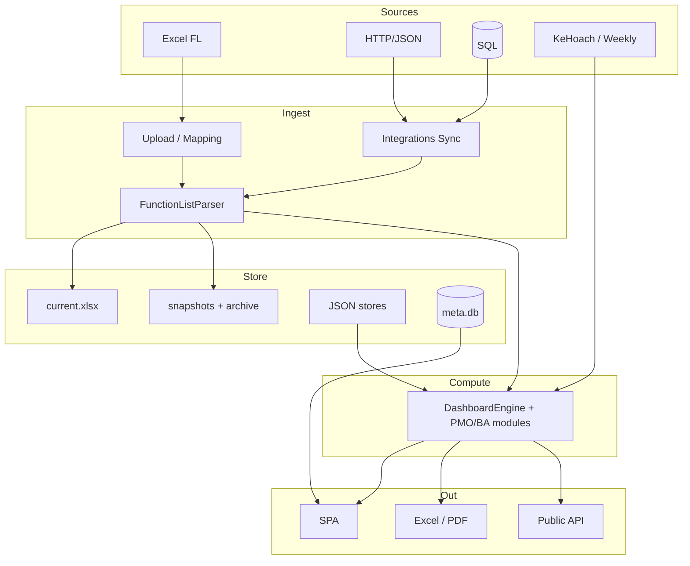

# Kiến trúc hệ thống — iHRP Function List Tracker

> **Single source of truth** kỹ thuật (cập nhật **2026-08-04**).  
> Tổng quan sản phẩm → [SYSTEM_OVERVIEW.md](SYSTEM_OVERVIEW.md). Catalog feature → [FEATURE_CATALOG.md](FEATURE_CATALOG.md).

## Mục lục

1. [Mục đích sản phẩm](#1-mục-đích-sản-phẩm)
2. [Tech stack](#2-tech-stack)
3. [Cấu trúc thư mục](#3-cấu-trúc-thư-mục)
4. [Data flow end-to-end](#4-data-flow-end-to-end)
5. [Project storage layout](#5-project-storage-layout)
6. [Auth & security](#6-auth--security)
7. [Module map](#7-module-map)
8. [API surface](#8-api-surface)
9. [Frontend architecture](#9-frontend-architecture)
10. [Testing](#10-testing)
11. [Tài liệu liên quan](#11-tài-liệu-liên-quan)
12. [Roadmap còn lại (P2)](#12-roadmap-còn-lại-p2)

---

## 1. Mục đích sản phẩm

Ứng dụng **dashboard local** cho PM/BA dự án triển khai HRIS **iHRP**.

- Nhận Function List Excel (hoặc sync API/DB) → auto-detect cột → metrics đa chiều.
- Multi-project, snapshot/archive, Forecast, PMO (SV/EVM/CR/Risk/UAT), BA UX, Chiều PM.
- Export Excel/PDF/MoM; Public API / LAN read-only.

Nguyên tắc `.cursorrules`: không hardcode cột; overdue = End < today ∧ Status ∉ {Closed, Cancelled}; status chuẩn hóa; PIC tách `, ; + \n`.

---

## 2. Tech stack

| Lớp | Công nghệ |
|-----|-----------|
| Backend | Python 3.10+ / **Flask 3** |
| Frontend | Vanilla ES6, Tailwind CDN, Chart.js CDN (không build step) |
| Excel | **openpyxl** (không pandas) |
| HTTP integrations | **requests** + **beautifulsoup4** (CSRF form login) |
| PDF (client) | html2canvas + jsPDF |
| PNG public (optional) | Playwright + Chromium |
| DB integration (optional) | pyodbc / psycopg2 / pymysql — lazy |
| Persistence | File JSON + pickle + xlsx; **Phase F:** `meta.db` (SQLite WAL) dual-write cho settings/bookmarks/tags |
| Test | pytest (+ pytest-cov, requests-mock) |

Launcher: `start.bat` / `start.sh`.

---

## 3. Cấu trúc thư mục

```
Project_Tracking/
├── start.bat / start.sh
├── requirements.txt
├── .env / .env.example          # KHÔNG commit .env
├── app.py                       # ~100 routes admin + public + embed
├── parser/
│   ├── excel_parser.py          # Auto-detect + parse FL
│   ├── column_mapping.py
│   ├── pm_plan_parser.py
│   └── pm_weekly_parser.py
├── analyzer/                    # Metrics, storage, integrations
│   ├── dashboard_engine.py      # compute_all (+ module risk %, remaining)
│   ├── overdue|unassigned|stalled|data_quality|rlog_weekly.py
│   ├── fid_check|duration_flag|weekly_gap_report.py   # Issues hub 2026-08
│   ├── forecast_gantt|forecast_manpower|estimate_ratio|pic_overload|pic_upcoming.py
│   ├── baseline_sv|completion_forecast|earned_value|scope_creep.py
│   ├── risk_scorer|module_dependency|uat_quality.py
│   ├── gantt_calendar|function_diff|fl_reimport_verify.py
│   ├── snapshot_manager|archive_manager|disk_janitor.py
│   ├── project_manager|project_store|sqlite_store.py
│   ├── integrations|public_api|lan_security|pm_store.py
│   ├── ba_task_store|smart_suggest.py
│   └── … (portfolio, kanban, digest, drill_down, …)
├── exporter/                    # Excel MoM, FL, forecast, weekly_gap, BA task…
├── templates/                   # index.html SPA + embed.html
├── static/css|js/               # dashboard.js, sidebar_hubs.js, help, i18n
├── tests/
├── uploads/projects/            # Per-project workspace (+ meta.db)
├── .project_store/              # users.json (hash MK), secret_key, tokens, access.log
└── docs/
```

---

## 4. Data flow end-to-end

### 4.1 High-level



### 4.2 Upload / Sync

```
Upload-preview → mapping confirm → parse → compute_all
  → SnapshotManager.save (source=upload|sync:…)
  → _state[slug] cache

Sync: auth → fetch → parse → snapshot → eager-reload _state
  → FE cacheBust + refresh
```

### 4.3 Đọc dashboard

```
GET /api/projects/<slug>/dashboard?module=&process=&pic=
  → load state → optional filter → compute_all → JSON

PMO/BA routes riêng: /baseline-sv, /earned-value, /scope-creep,
  /completion-forecast, /pmo-risk, /uat-quality, /pic-upcoming,
  /function-diff, /fl-reimport-verify, /fid-check, /duration-flag,
  /weekly-gap-report, /export-weekly-gap, …
```

---

## 5. Project storage layout

```
uploads/projects/
├── projects.json
└── <slug>/
    ├── meta.json
    ├── meta.db                      # Phase F — settings / bookmarks / tags
    ├── current.xlsx
    ├── integrations.json
    ├── archive_settings.json
    ├── project_settings.json        # dual-write mirror
    ├── bookmarks.json               # dual-write mirror
    ├── tags.json / function tags    # dual-write mirror
    ├── saved_views.json             # file-only
    ├── section_order.json / module_order.json
    ├── capacity.json / chart_* / custom_dashboards.json
    ├── fl_export_schema.json
    ├── upload_history.json
    ├── exports/ · digests/ · synced_*.xlsx
    ├── pm/                          # plan + weekly (+ janitor dedupe PPTX)
    └── snapshots/
        ├── snapshot_index.json      # source, archived, …
        ├── YYYY-MM-DD_*.xlsx + .parsed.pkl
        └── archive/                 # *.gz
```

| Lớp | Nội dung |
|-----|----------|
| **SQLite dual-write** | `project_settings`, bookmarks, function_tags — đọc ưu tiên `meta.db`, fallback JSON |
| **File-only** | FL/snapshots, saved_views, section/module order, capacity, charts, integrations, PM, archive settings, history… |
| **Janitor (startup)** | exports cũ; excess snapshots; `synced_*.xlsx` (keep ≤5); duplicate `*weekly*.pptx` khi đã có `weekly.pptx` |

Snapshot entry: `source` (`upload` \| `sync:…`), `archived`, metrics tóm tắt. Chi tiết → [DATA_MODEL.md](DATA_MODEL.md).

---

## 6. Auth & security

| Cơ chế | Mô tả |
|--------|--------|
| `.env` credentials | Không lưu trong `integrations.json` |
| Admin localhost-only | Mutation `/api/*` (trừ export) chỉ loopback / allowlist |
| LAN bind | Default `127.0.0.1`; `IHRP_LAN=1` → `0.0.0.0` |
| Public tokens | SHA-256, scope, rate limit |
| `verify_ssl` | Per-integration (default true) |
| Access log | `.project_store/access.log` |

---

## 7. Module map

### Parse & core metrics

| Module | Trách nhiệm |
|--------|-------------|
| `parser/excel_parser.py` | Header detect, phase groups, status/PIC/date |
| `parser/column_mapping.py` | Mapping Wizard |
| `dashboard_engine.py` | `compute_all` — summary, matrix, PIC, module remaining, bottleneck… |
| `overdue` / `unassigned` / `stalled` / `data_quality` | Rule cảnh báo |
| `fid_check.py` | Dev Closed nhưng FID trống / trùng |
| `duration_flag.py` | Phase Start→End vượt ngưỡng (mặc định 60 ngày) |
| `weekly_gap_report.py` | Function/phase sẽ xong trong tuần (FIT/GAP filter) |
| `rlog_weekly.py` | Rlog coded / plan tuần |
| `advanced_metrics.py` | Burndown, SLA, capacity, aging, slow, baseline-in-file |
| `drill_down` / `generic_chart` / `kanban` / `fitgap_analytics` | Phân tích (+ `scope=remaining\|all`) |
| `ba_task_store` / `smart_suggest` | Đầu việc BA / gợi ý |

### Forecast / PMO / BA

| Module | Trách nhiệm |
|--------|-------------|
| `forecast_gantt.py` | Milestone theo tháng đa dự án |
| `forecast_manpower.py` | MH/MD/MM + hire |
| `estimate_ratio.py` | Ước lượng theo hệ số (parametric) |
| `pic_overload.py` | Overload đa dự án |
| `pic_upcoming.py` | PIC × tuần tới |
| `baseline_sv.py` | SV cross-snapshot |
| `completion_forecast.py` | Ngày xong từ velocity |
| `earned_value.py` | EVM |
| `scope_creep.py` | CR / scope creep |
| `risk_scorer.py` | Risk + `compute_pmo_risk` |
| `module_dependency.py` | Cascade delay heuristic |
| `uat_quality.py` | Defect / reopen / cycle |
| `gantt_calendar.py` | Timeline + critical path heuristic |
| `function_diff.py` | Diff vs snapshot |
| `fl_reimport_verify.py` | Verify yellow-hit sau re-import |

### Storage & ops

| Module | Trách nhiệm |
|--------|-------------|
| `project_manager.py` | CRUD project |
| `snapshot_manager.py` | Snapshot + load archived |
| `archive_manager.py` | Gzip archive / restore / purge |
| `project_store.py` | JSON + cầu nối SQLite |
| `sqlite_store.py` | `meta.db` WAL meta slice |
| `disk_janitor.py` | Dọn đĩa startup |
| `pm_store.py` | Chiều PM |
| `lan_security.py` / `public_api.py` / `integrations.py` | Secure share / sync |

### Exporter (chọn lọc)

`excel_exporter`, `weekly_mom`, `weekly_gap_exporter`, `fl_reimport_export`, `forecast_*_exporter`, `pic_overload_exporter`, `pm_exporter`, `rlog_exporter`, `ba_task_exporter`, `export_all_issues`…

### Phiên bản static asset — `_static_ver()`

`?v=` gắn vào URL JS/CSS **định danh bản đang chạy**, không phải file trên đĩa:

| Chế độ | `?v=` | Lý do |
|---|---|---|
| `--debug` (template bám đĩa) | mtime từng file | sửa file nào chỉ file đó tải lại; HTML cũng đã theo kịp |
| PRODUCTION (mặc định `start.bat`) | `_BUILD_STAMP` cố định theo process | Jinja giữ template trong RAM và `.py` không nạp lại |

Chốt điều kiện bằng `_templates_track_disk()` chứ không phải `app.debug` trực
tiếp, để ai set `TEMPLATES_AUTO_RELOAD` tường minh vẫn đúng.

Vì sao không dùng mtime ở PRODUCTION: `static_ver()` chạy **lúc render** nên
mtime mới có hiệu lực ngay, trong khi HTML và `.py` vẫn đứng ở bản lúc khởi
động → browser nhận **JS mới trên HTML cũ với backend cũ**. Nút cũ gọi hàm mới,
hàm mới gọi endpoint chưa có, lỗi hiện ở chỗ không liên quan tới thay đổi vừa
làm. Ghim theo process biến nó thành hành vi đoán được: **chưa restart thì không
gì đổi.** Vẫn phải restart sau khi sửa `.py` / `templates/`.

Bổ trợ: `_no_cache_html()` (after_request) trả `Cache-Control: no-cache,
must-revalidate` cho mọi response `text/html`. Ghim `?v=` vô nghĩa nếu browser
dùng lại HTML cũ, vì bản cũ nhúng `?v=` cũ. Chỉ chạm HTML — JSON API và file
Excel tải về giữ nguyên.

Cái không cơ chế nào chữa được: **tab đang mở** vẫn chạy bundle JS trong bộ nhớ
tới khi reload. Triệu chứng: toast `<tên hàm> is not defined` với tên không tồn
tại trong source. Cách phân biệt nhanh — grep tên đó trong repo; không thấy kể cả
trong git history thì là bundle cũ trong tab, không phải bug code.

### Badge «Bản đang chạy» — làm ba trạng thái lệch nhau hiện ra

Ba trạng thái dưới đây có thể lệch nhau mà trước đây không ai thấy được, và mỗi
lần lệch là một lần truy bug tốn công:

| Trạng thái | Phát hiện bằng | Cách chữa |
|---|---|---|
| Server chạy code cũ | mtime của `.py` / `templates/` > `_BUILD_STAMP` | Restart server |
| Tab giữ bundle JS cũ | `static_mtime` > thời điểm **trang được nạp** | Tải lại giao diện |
| Repo có commit mới | `git fetch` + so ahead/behind | `git pull` bằng tay |

`analyzer/build_info.py` lo phần phát hiện, `/api/build-info` phục vụ badge trên
header (poll 60 giây, và kiểm ngay khi tab được focus — đúng lúc người dùng vừa
sửa code xong quay lại).

Hai quyết định thiết kế đáng nhớ:

**Danh sách file theo dõi lấy từ `sys.modules`, không hardcode.** Đó là đúng những
file process *đang thực sự nạp*, nên tự động bỏ qua `tests/`, script ad-hoc ở root
và thư viện — không cần danh sách loại trừ phải bảo trì. Phải loại thêm `sys.prefix`
và `site-packages` vì `start.bat` tạo venv **bên trong** project: không loại thì
site-packages bị tính là code của mình, đo được 317 file thay vì 29.

**So `static_mtime` với thời điểm trang được nạp, không phải với `_BUILD_STAMP`.**
Trang có thể được nạp muộn hơn lúc server khởi động rất nhiều; so với stamp của
server sẽ bỏ sót đúng trường hợp tab mở từ sáng — chính là ca `apFetch`.

### Restart từ dashboard

`POST /api/restart` không tự restart process mà **giao cho `start.bat`**, qua
`restart_helper.bat`. Bảo vệ hai lớp: `install_admin_guard` đã chặn mọi POST từ
non-localhost, cộng thêm yêu cầu role admin.

Vì sao không `os.execv` hay tự spawn `python app.py`: process đang giữ socket
lắng nghe port 5000. `os.execv` thay ảnh process nhưng không dọn sạch
handle/thread của Werkzeug; tự spawn thì process mới không bind được port cho tới
khi process cũ nhả. `start.bat` đã có sẵn bước dọn process chiếm port, kèm venv và
cài dependency.

Bốn cái bẫy phải thiết kế vòng qua (chi tiết trong docstring
`analyzer/restart_service.py`):

1. **`taskkill /F /T` kill cả cây con theo PPID** — spawn `start.bat` làm con trực
   tiếp thì nó tự kill chính mình. Phải qua `restart_helper.bat` dùng lệnh `start`
   rồi thoát ngay, để cha của `start.bat` thành một PID đã chết.
2. **Không truyền lệnh lồng nhau vào `cmd /c`** — `subprocess.list2cmdline` escape
   quote theo quy ước MSVC (`\"`) mà `cmd.exe` không hiểu, nên lệnh **im lặng không
   chạy gì** trong khi `Popen` vẫn báo thành công. Đã đo bằng thực nghiệm: biến thể
   inline thất bại, biến thể có file `.bat` chạy đúng.
3. **Job Object** — nếu process nằm trong một job, Windows kill mọi hậu duệ khi job
   đóng, nên server vừa lên lại chết theo. Dùng `CREATE_BREAKAWAY_FROM_JOB`, thất
   bại thì quay về cách thường.
4. **`start.bat` không được treo ở `pause`** khi bị lần restart sau taskkill: nếu
   không, mỗi lần restart để lại một cửa sổ kèm thông báo `[LOI]` sai lệch. Cờ
   `IHRP_RESTART=1` xử lý việc này; chạy tay (double-click) thì vẫn dừng để đọc log.

Cố ý **không tự exit** sau khi spawn: `start.bat` kiểm tra Python **trước** bước
kill, nên môi trường lỗi thì nó dừng và báo mà server cũ vẫn còn sống để phục vụ.
Tự exit trước sẽ đổi một lỗi hiển thị được thành cảnh không còn server nào cả.

Chỉ hỗ trợ Windows. `start.sh` không dọn process giữ port nên trên Linux/Mac
server mới sẽ va "Address already in use" — endpoint trả 501 kèm hướng dẫn làm tay
thay vì ship một nhánh chưa kiểm mà lại có quyền giết server.

### Vì sao không có nút «tự pull từ GitHub»

`/api/git-info` chỉ **đọc và báo**. Không có endpoint pull/checkout/reset, và
`tests/test_build_info.py` chốt bất biến đó. Ba lý do:

- Endpoint pull được từ UI web là **đường thực thi code tuỳ ý**. App có LAN mode và
  role admin/viewer; lộ ra là ai vào được dashboard cũng khiến server chạy bất cứ
  gì trên remote branch.
- Working tree ở đây thường có **nhiều file chưa commit**. `git pull` sẽ conflict
  hoặc buộc stash/reset — tức xoá việc đang làm. Panel hiện rõ số file dirty kèm
  cảnh báo thay vì âm thầm stash.
- Code mới có thể đổi `requirements.txt` hoặc cần migrate dữ liệu. Update tự động
  mà thiếu bước đó sẽ để lại một app chết và không còn UI nào để sửa.

### «Reset giao diện» ≠ clear cache

JS **không thể** xoá HTTP cache: `location.reload(true)` có tham số `forceGet` đã
deprecated và bị mọi browser hiện đại bỏ qua. Nút «Reset giao diện» xoá
`localStorage` — thứ mà reload *không* chữa được: tuỳ chọn cũ trỏ tới module hay
section đã biến mất sẽ làm filter ra rỗng hoặc layout lệch mà không có thông báo
nào. Vì đây là dữ liệu người dùng tự sắp đặt (project đang chọn, theme, thứ tự
sidebar, bộ lọc đã ghi nhớ), nút này liệt kê rõ những gì sẽ mất rồi mới xoá.

### Lint JS: chặn ReferenceError trước khi lên browser

`ReferenceError` trong JS là điểm mù của suite Python: nó chỉ nổ lúc chạy, thường
trong nhánh `catch`, nên chỉ hiện ra dưới dạng toast mơ hồ. ESLint rule
`no-undef` bịt khoảng trống này.

Chạy: `npm install` một lần, rồi `npm run lint` — hoặc để pytest gọi hộ qua
`tests/test_js_no_undef.py` (tự bỏ qua nếu máy không có Node; app vẫn chạy bằng
Python thuần, Node chỉ là tooling).

Điểm khó và cách giải: `static/js/*.js` là **classic script**, không phải ES
module. Chúng dùng chung một global scope, nên `sidebar_hubs.js` gọi
`showToast()` định nghĩa trong `dashboard.js` là hợp lệ — nhưng ESLint xét từng
file riêng và sẽ báo sai hàng loạt (thực đo: 81 lỗi giả). `eslint.config.mjs` giải
bằng cách dùng chính parser của ESLint (espree) đọc AST mọi file, lấy top-level
declaration **và** các export kiểu `global.X = ...`, rồi khai báo chúng làm globals
dùng chung. Danh sách tự sinh nên không lạc hậu khi thêm/xoá hàm. Config phải nhìn
xuyên qua pattern IIFE `(function (global) {...})(typeof window !== "undefined" ?
window : globalThis)` mà `i18n.js` và `sidebar_hubs.js` đang dùng.

Hook tuỳ chọn (hàm có thể do script khác cấp, có thể không tồn tại) phải viết
dạng `typeof window.X === "function"` chứ không phải `typeof X`. Dạng `window.X`
nói rõ đây là hook ngoài và giữ linter sạch mà không cần danh sách miễn trừ.

`tests/test_js_no_undef.py` có **canary**: một test chỉ khẳng định "0 lỗi" sẽ pass
rỗng nếu config hỏng và ESLint không quét gì. Canary chèn đúng lỗi đã xảy ra thật
(`apFetch`) vào một file tạm trong `static/js` và đòi ESLint phải tố giác.

---

## 8. API surface

~**100** `@app.route` trong `app.py`. Ba lớp:

### A. Admin (localhost mutations)

**Projects / ingest:** CRUD, upload, mapping, integrations sync.

**Analytics (GET, LAN-readable):** dashboard, overdue, unassigned, stalled, risk-scores, drill-down, gantt-calendar, data-quality, aging-wip, kanban, burndown, sla, capacity-load, fitgap, function-diff, custom-dashboard, **baseline(-sv), completion-forecast, earned-value, scope-creep, pmo-risk, uat-quality, pic-upcoming, fl-reimport-verify, fid-check, duration-flag, weekly-gap-report, saved-views, tags…**

**Cross-project:** `/api/forecast-gantt`, `/api/pic-overload`, `/api/portfolio/*`.

**Snapshots / archive / compare:** list, compare, archive-settings, archive-run, restore.

**Exports:** overdue, full, by-pic, compare, all-issues, MoM, FL re-import, **weekly-gap**, chart, audit, Rlog, manpower, overload…

**Settings / UX:** settings, chart-notes/config, bookmarks, notes, digests, capacity, section-order, module-order, phase-aliases, public-tokens, LAN info.

### B. Public (token)

```
GET /public/api/v1/projects/<slug>/summary
GET /public/api/v1/projects/<slug>/charts/<chart_id>
GET /public/api/v1/projects/<slug>/charts/<chart_id>/image
GET /public/api/v1/projects/<slug>/functions?page=&size=
```

### C. Embed

```
GET /embed/<slug>/<chart_id>?token=&bg=
```

Legacy routes không có `/projects/<slug>/` → project `"default"`.

---

## 9. Frontend architecture

SPA: `templates/index.html` + `dashboard.js` + `sidebar_hubs.js` + `help_content.js` + `i18n.js`.

### Shell

- Header: project, search, dark mode, API Registry, Sync, PDF, Xuất, Present, Settings, Help, Ctrl+K.
- **Insight strip:** chips tóm tắt (+ delta OD/UA/ST); collapse → `localStorage` `ihrp.insightStrip.expanded`.
- Sidebar hub (`sidebar_hubs.js`): **TỔNG QUAN / VẤN ĐỀ (Issues) / TIẾN ĐỘ / Forecast / …** — tab lazy-load.
- Global filter Module × Process × PIC × Project.
- Drill modal: scope **Chỉ còn lại / Tất cả** (khớp cột Module «Còn lại»).
- `apiJson()` — lỗi HTML → message thân thiện.

### Default section order

Tiến độ (module…gantt…forecast…rlog) → vấn đề (overdue…DQ…**fid-check / duration-flag / weekly-gap**…uat-quality) → phân tích (capacity…overload…**baseline/evm/scope-creep**…diff) → PM → admin.

Chi tiết ID → [FEATURE_CATALOG.md](FEATURE_CATALOG.md) · [DASHBOARD_SPEC.md](DASHBOARD_SPEC.md).

### Help

Section `?` + Ctrl+/ + onboarding. Topic DQ: `dataquality`. Guide: [HELP_CONTENT_GUIDE.md](HELP_CONTENT_GUIDE.md).

---

## 10. Testing

```bash
pytest -q
pytest tests/test_baseline_sv_forecast.py tests/test_earned_value.py \
  tests/test_scope_creep.py tests/test_pmo_risk_phase_d.py \
  tests/test_uat_quality.py tests/test_sqlite_store.py \
  tests/test_ba_ux_backlog.py -q
```

Suite lớn (hàng trăm test) phủ parser, engine, integrations, archive, PMO, BA UX.

---

## 11. Tài liệu liên quan

| File | Nội dung |
|------|----------|
| [README.md](README.md) | Index + reading order cho review |
| [SYSTEM_OVERVIEW.md](SYSTEM_OVERVIEW.md) | Big picture + gaps |
| [FEATURE_CATALOG.md](FEATURE_CATALOG.md) | Checklist feature |
| [BUSINESS_LOGIC.md](BUSINESS_LOGIC.md) | Công thức / rule |
| [CHANGELOG_PMO_BA.md](CHANGELOG_PMO_BA.md) | PMO/BA đã ship |
| [DATA_MODEL.md](DATA_MODEL.md) | Schema |
| [DASHBOARD_SPEC.md](DASHBOARD_SPEC.md) | Spec UI |
| Guides | Integrations, Public API, LAN, Archive, PM, Help |
| [BUGS_TODO.md](BUGS_TODO.md) | P2 backlog |
| UPGRADE_*.md | Historical |

---

## 12. Roadmap còn lại (P2)

**Đã ship:** Core multi-project, Forecast, Chiều PM, Archive, Public/LAN, **PMO A–F**, **BA UX**, disk janitor, insight strip, DQ help…  
→ [CHANGELOG_PMO_BA.md](CHANGELOG_PMO_BA.md).

**Pending:**

| ID | Mô tả |
|----|--------|
| **T-B** | API Registry Catalog — metadata, filter, health, Postman import |
| **T-C** | `form_login` wizard đầy đủ (cookie jar bền, CSRF UX, 2FA optional) — form_login cơ bản đã dùng được |

**Không có trong backlog hiện tại (gap sản phẩm):** SQLite cutover full; CPM critical path thật. (Ước lượng theo hệ số: `estimate_ratio.py`.)

Resume pointer: root `_WIP_RESUME_NOTES.md` (chỉ P2 — không phải mô tả kiến trúc).
