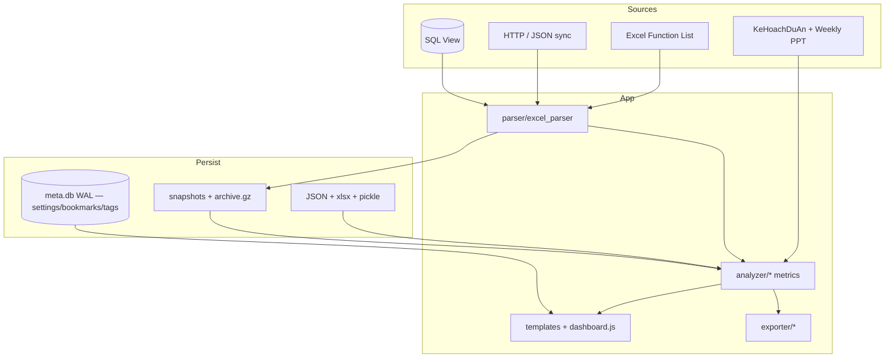

# Hệ thống iHRP Function List Tracker — Tổng quan

> Cập nhật: **2026-08-04** (Issues hub FID/Duration/Weekly GAP + stalled/status/module drill).  
> Lối vào cho PM/BA và reviewer ngoài. Chi tiết rule → [BUSINESS_LOGIC.md](BUSINESS_LOGIC.md); checklist → [FEATURE_CATALOG.md](FEATURE_CATALOG.md).

---

## 1. Sản phẩm là gì?

Ứng dụng **dashboard local** (Flask + SPA vanilla JS) cho **PM/BA** dự án triển khai **HRIS iHRP**.

```
Function List Excel ──parse──► Metrics / Rules ──► Dashboard UI
         ▲                          │
    Sync API/DB                     ├── Export Excel / PDF / MoM / FL re-import
         │                          ├── Forecast (Gantt tháng, Manpower, Overload)
Chiều PM (KeHoach + Weekly PPT)     ├── PMO (SV, EVM, CR, Risk, UAT Quality)
                                    └── Public API / LAN / Archive
```

| Ai dùng | Cách dùng |
|---------|-----------|
| PM / BA solo | Máy local (`127.0.0.1`) |
| Team tin cậy | LAN read-only (`IHRP_LAN=1`) + Public API token |

**Không phải** SaaS multi-tenant. Persistence chủ yếu **file** dưới `uploads/projects/<slug>/`; Phase F thêm **SQLite `meta.db`** cho một slice metadata (dual-write).

---

## 2. Nguyên tắc gốc (`.cursorrules`)

| # | Rule |
|---|------|
| 1 | **Không hardcode cột** — đọc header row 1; phase = `PhaseName - Attribute` |
| 2 | **Overdue** = có End < today và Status ∉ {Closed, Cancelled} (+ ngoại lệ phase sau Closed) |
| 3 | **Status** chuẩn: Open, Assigned, In-progress, Resolved, Closed, Pending, Cancelled; số ở Status = lỗi lệch cột; **Not Started** → Open (không PIC) / Assigned (có PIC); Finished/Done → Closed; status lạ → blank |
| 4 | **PIC** tách bởi `,` `;` `+` `\n` |

---

## 3. Kiến trúc (mermaid)



Chi tiết folder / API → [ARCHITECTURE.md](ARCHITECTURE.md).

---

## 4. Data flow chính

### 4.1 Nạp Function List

```
Upload / Sync → Column Mapping (optional) → FunctionListParser
  → SnapshotManager (source=upload|sync:…)
  → _state[slug] + current.xlsx
  → DashboardEngine.compute_all (+ module PMO/BA theo route)
```

### 4.2 Persistence (tóm tắt)

| Loại | Ví dụ | Ghi chú |
|------|--------|---------|
| File hot | `current.xlsx`, snapshots `.xlsx`+`.pkl` | Metrics tính lại từ ParsedData |
| JSON | capacity, saved_views, section_order, integrations, PM… | Vẫn là nguồn chính hầu hết config |
| SQLite | `meta.db` — settings, bookmarks, function_tags | Dual-write + đọc ưu tiên SQLite |
| Archive | `snapshots/archive/*.gz` | Gzip; load transparent |
| Janitor (startup) | prune exports, excess snapshots, `synced_*.xlsx`, PPTX weekly trùng | `disk_janitor.py` |

### 4.3 Filters

- **Global:** Module × Quy trình × PIC × Mã dự án  
- **Local:** theo section (Kanban AND global; Timeline Status/Phase…)  
- **Saved views:** lưu/khôi phục bộ filter (`saved_views.json`)  
- Export chart: `mode=summary|detail|both` → sheet `Tong_hop` / `Chi_tiet`

---

## 5. Nhóm dashboard (IA)

Sidebar lọc theo nhóm; **All** = hiện hết. Tùy chỉnh VI/EN + chuyển section (`localStorage` `ihrp_sidebar_groups_v2`).

| Nhóm | Mục đích | Section tiêu biểu |
|------|----------|-------------------|
| **Tracking / Tiến độ** | Tiến độ tổng thể | Summary, Module (+ còn lại + drill scope), Công việc, Matrix (+ bottleneck), Phase, Rlog, **PIC tuần tới**, Hoạt động tuần |
| **VẤN ĐỀ / Issues hub** | Cảnh báo vận hành | Overdue, Chưa PIC, Đình trệ, WIP, Data Quality, **Thiếu FID**, **Thời gian dài**, **Báo cáo tuần GAP** |
| **Forecast** | Thời gian & lực lượng + PMO lịch/effort | Gantt, Forecast UAT/Golive, Manpower, Calendar (+ critical path), Capacity, PIC Overload, **Baseline SV**, **EVM**, **Scope Creep** |
| **Chất lượng** | DQ / risk / UAT | Data Quality (+ highlights), Risk, Anomaly, **UAT Quality** |
| **Phân tích** | Sâu hơn | Quy trình, PIC, Effort, Diff, Kanban, Bookmarks… |
| **Chiều PM** | Kế hoạch + weekly PPT | Chiều PM, Digest |
| **Quản trị** | So sánh / custom / history | Compare, Custom dash, History |

**Thứ tự DOM mặc định:** tiến độ tổng thể → timeline/forecast → cảnh báo → UAT Quality → phân tích (gồm Baseline/EVM/CR) → PM → admin. Nút **↺ Mặc định** áp `DEFAULT_SECTION_DOM_ORDER`.

**UX shell:** Insight strip (chip OD/UA/ST delta vs snapshot trước) có thể **collapse**; Help topic **Data Quality**.

---

## 6. Ba lớp năng lực đã ship

### 6.1 Core (ổn định)

Auto-detect cột · overdue/unassigned/stalled/DQ · multi-project · snapshots · archive · sync integrations · export MoM/FL · Public API · LAN.

### 6.2 Forecast & chiều PM

Forecast Gantt (milestone theo tháng) · Forecast Manpower (MH/MD/MM + tuyển) · PIC Overload đa dự án · Rlog tuần · Chiều PM (KeHoach + Weekly) · Capacity PIC.

### 6.3 PMO Phase A–F + BA UX

| Phase | Nội dung |
|-------|----------|
| A | Baseline snapshot + Schedule Variance (SV ngày) cross-snapshot |
| B | Completion forecast từ velocity 4 tuần |
| C | EVM (EV/PV/AC → SPI/CPI) + Scope creep / CR |
| D | PMO risk rollup + module cascade + PIC overload |
| E | UAT Quality (defect / feedback / reopen / cycle) |
| F | SQLite `meta.db` dual-write (settings / bookmarks / tags) |
| BA 1–11 | Diff, saved filters, insight trends, DQ highlights, bulk tags, critical path, FL verify, bottleneck, PIC upcoming, Rlog section/chips, Module còn lại |
| **Issues 2026-08** | FID check (Dev Closed thiếu/trùng FID) · Duration flag (Start→End > ngưỡng) · Weekly GAP report + Excel 2-sheet · Stalled nới (không cần End; gate prev Closed) · Module risk theo % · Drill `scope=remaining\|all` |

Chi tiết checklist → [FEATURE_CATALOG.md](FEATURE_CATALOG.md) · tóm tắt ship → [CHANGELOG_PMO_BA.md](CHANGELOG_PMO_BA.md).

---

## 7. Export — ma trận nhanh

| Nút / API | Đầu ra |
|-----------|--------|
| Chart 📥 | Tong_hop + Chi_tiet (+ Theo_nhom nếu task_type) |
| Xuất MoM tuần | Cover, Master, Gantt, MoM_Wxx, Risk Analysis, PM… |
| Xuất FL chỉnh sửa | 1 sheet FL — vàng PIC/Status/FID, xanh date-chain |
| Báo cáo tuần GAP | Sheet Tổng quan (Module×Phase) + Chi tiết |
| Forecast Gantt / Manpower / Overload | Excel riêng |
| Function Diff / Rlog / All issues | Excel chuyên biệt |
| PDF | Client html2canvas + ghi chú chart |

---

## 8. Bảo mật (solo / LAN)

| Chế độ | Hành vi |
|--------|---------|
| Mặc định | Bind **`127.0.0.1`** |
| `IHRP_LAN=1` | Bind `0.0.0.0` + cảnh báo |
| Admin mutation | Chỉ localhost (trừ override) |
| Public API | Token SHA-256, scope, expiry, rate limit |

---

## 9. Cách chạy & kiểm thử

```bat
start.bat
```

```bash
pytest -q
```

---

## 10. Gaps / hạn chế (trung thực)

| Hạng mục | Trạng thái |
|----------|------------|
| SQLite | Chỉ **meta slice** (settings, bookmarks, tags); FL/metrics/snapshots vẫn file |
| Critical path trên Gantt Calendar | **Heuristic**: row có segment chưa xong kết thúc muộn nhất — không phải dependency graph |
| FL re-import verify | Chỉ verify ô **yellow-hit** (PIC/Status issue) từ snapshot trước theo `ma_cn` — không diff mọi cell |
| Trends | Chip delta OD/UA/ST trên insight strip — không phải module trend analytics riêng |
| Rlog “badges” | Section Rlog đầy đủ + insight chips; không có badge Rlog kiểu DQ trên mọi bảng |
| P2 integrations | API Registry Catalog (T-B), form_login wizard đầy đủ (T-C) — xem [BUGS_TODO.md](BUGS_TODO.md) |

---

## 11. Đọc tiếp

1. [FEATURE_CATALOG.md](FEATURE_CATALOG.md)  
2. [BUSINESS_LOGIC.md](BUSINESS_LOGIC.md)  
3. [ARCHITECTURE.md](ARCHITECTURE.md)  
4. [CHANGELOG_PMO_BA.md](CHANGELOG_PMO_BA.md)  
5. Guides: Archive · Integrations · Public API · PM dimension · Help  
